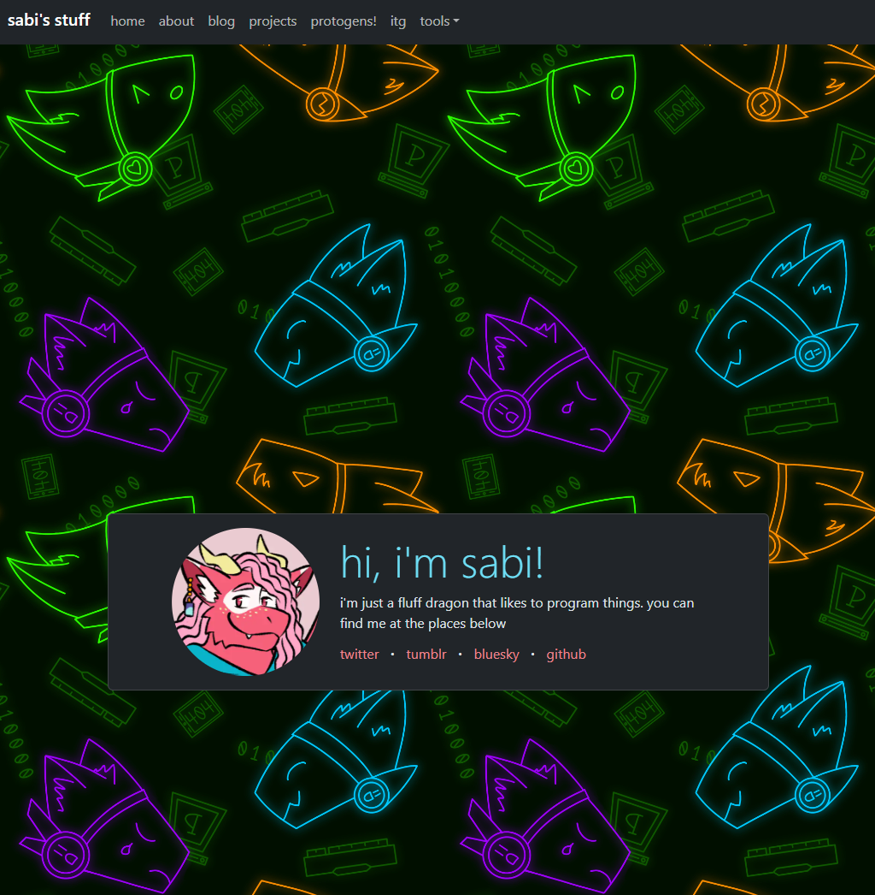

so i ended up not just finally styling the blog, but actually restyling the whole website lol. before i built this site, i actually started on my own site using [neocities.org](https://neocities.org) (shoutout to the revival of the old web, fuck the modern internet), which you can view [here](https://ewavstudio.neocities.org). in fact, the beginnings of that project is actually what inspired me to make this site because i already had experience with website building beforehand with react and js, and i didn't like writing plain html and css lol. so after a bit of time searching around for frameworks, i decided on [gatsby](https://gatsbyjs.com) instead of [next.js](https://nextjs.org) because of it's focus on static sites

but when building the site, i ended up going with [bootstrap](https://getbootstrap.com) for styling the site because that's what i'd used at my job and it's what i had experience with. i also wanted something opinionated at the time, since i didn't want to spend a lot of time styling my site. but then my friend said it tends to look the same as a bunch of other sites built with bootstrap and that thought just never left lmao

a few months ago, another 音ゲー friend of mine named matcha told me he was making his website (which you can find [here](https://matcha.cat)!) and was doing the styling with tailwind. i'd heard of it before, but didn't know anything about it, and wasn't sure i wanted to touch anything unopinionated yet. but around a few weeks ago, i decided i was tired of staring at my basic-ass bootstrap site, so i ripped out it's innards and restyled it using tailwind haha. thankfully, there's an official guide on getting tailwind working with gatsby, so the bulk of the time was spent just trying to get the styling right and making it look how i wanted, which was surprisingly easy. i also learned how to style markdown along the way for blog posts, so i decided to make it part of the site redesign. so, here we are! a better-looking site than before, in my opinion lol. it feels a lot more ✨ me ✨

but i'm realizing that i don't quite have obsidian integration set up as well as i want lol. so i have to figure out a better way of writing blog posts -_-

### before

### after

