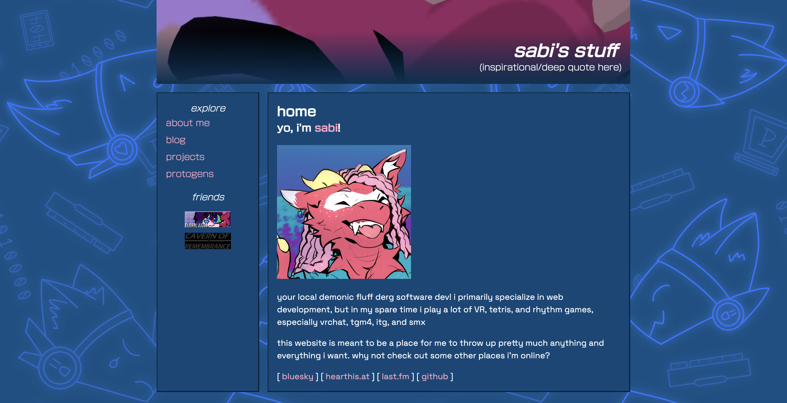

### the seeds

a few months ago, a close friend of mine had decided to undergo the process of rebuilding their website using 11ty after copy-pasting html and css for awhile. i also had been stumbling across other sites on the web, and was inspired by their early internet feel, something my previous site felt like it was lacking

i realized that, despite having just converted my entire site to typescript, that i didn't want to deal with the intricacies of js/ts and gatsby for building a website, and i didn't like how i had my site set up to be able to add art pieces and projects. these were handled via contentful integrations, which were convenient, but i liked having everything i needed in one directory. returning back to html and css, combined with some of the bonuses of templating, seemed very tempting. i didn't *need* react, i just reached for it because it's what i was familiar with

after reading my friend's blog post about their experience re-writing their site with 11ty (which you can read [here](https://floral.lgbt/blog/2025-10-16-11ty/)), and reading through some tutorials they linked, i decided to give it a try. below are the tutorials i found helpful:

- [flamed fury - create a static site using 11ty & deploy to neocities](https://flamedfury.com/guides/11ty-homepage-neocities/). note: this guide is out of date, but still works pretty well, in my opinion
- [petrapixel - 11ty (eleventy) tutorial](https://petrapixel.neocities.org/coding/eleventy-tutorial)

### removing and rearranging pages

i decided to remove the art and dj sets pages since i decided i'd rather just manage those elsewhere rather than deal with them on my own site. my dj sets can be found on [hearthis.at](https://hearthis.at/bix2) and my commissioned art can be found...currently nowhere but [here's my fa (!!nsfw!!)](https://furaffinity.net/user/zentixzane) for when i do upload it there...eventually...

### dates

the way 11ty deals with dates is...ngl pretty annoying to deal with. unless you provide datetimes in a very specific format, it assumes all dates and times are UTC. for context, in my post frontmatter, i write my dates like `YYYY-MM-DD`, which is easy and quick and i'm not gonna give that up because i'm a little stubborn. unfortunately, when you try to display the date, 11ty loves to automatically convert it to your timezone, which makes all the dates look a day off if you're in UTC-X (vs UTC+X) (this is something mentioned in the [docs](https://www.11ty.dev/docs/dates/#dates-off-by-one-day), but they don't really provide a solution). the way to fix this, i found, was to write a custom filter specifically for getting the date to appear as written. but i didn't know what the filter should be. thankfully, my friend razz (who's badge you can find on the left, if you're on a desktop display) had open-sourced the code for their site (thanks, razz <3), so i stole their custom filter lol. the code for this site is also open source, so if you wanna see what it looks like, my github is linked on the homepage here

### rss feed

my gatsby site didn't have this, but i've had friends tell me that it's helpful to have since it allows people to keep up with you/your site easily, and it's apparently really easy to set up with 11ty. and by god it is. [here](https://www.11ty.dev/docs/plugins/rss/), see for yourself

this also ended up sending me down a rabbit hole of trying to find an rss reader for reading other people's blogs and ngl, that's a whole 'nother article

### changing domains

instead of neocities, i use netlify to host my website for a few reasons:

- i get to use the domains i paid for for free
- i can host multiple projects for free (so i can host a browser start page with links i use and the previous version of this website)
- ~~automatic site deployments whenever i commit to github.~~ i've learned that neocities actually has a CLI (command line interface) for being able to push your website from the command line, and there's even a git hook to do this as well

that said, neocities is a great website and their mission is admirable, and they absolutely deserve your support. if you have the disposable income, you can donate [here](https://neocities.org/donate)

despite some initial confusion, switching domains to have v2 point to the gatsby version and the og domain point to the 11ty version wasn't difficult at all since i manage this domain via netlify. the general process went something along the lines of:

1. add `v2.sabi.pink` subdomain to gatsby version of the site and set that as the primary domain of the site
2. remove `sabi.pink` from the gatsby version of the site
3. add the `sabi.pink` domain to the 11ty version of the site

and the changes were pretty much instant, i didn't have to wait at all before going to `sabi.pink` showed me the 11ty site

### closing thoughts

all in all, i think 11ty is an excellent way to build a website, and i definitely think i'm going to be reaching for it if i need to build a static site in the future. however, i'm not sure i'm entirely satisfied with this site's design yet. i feel like a lot of early internet web design is about like "loud" design and gifs and pictures and icons and...that's not me. i like minimalism, i like text, i like simplistic but bold design. but hopefully this rewrite sets the foundation for transforming the site into something more like what i... like, i guess?

there's also still some features that i need to get working (i.e. site embeds don't at all, and i want to add blog index pages for different tags) but i'd been sitting on this project for too long and just needed to get it out there

### inspiration

here's a few sites that i was inspired by for this iteration, you should check them out! maybe i'll add a page for blogs and sites that inspire me in the future.... and if you find yourself inspired by my site, you can find the source code [here](https://github.com/sabidesu/sabi.pink)

- [razz!](https://floraltrash.neocities.org)
- [cavern of remembrance](https://cavernofremembrance.neocities.org)
- [randy reflects](https://www.randyreflects.com/) (note: i don't care for his use of gen ai, but besides that, i generally like the look and content of his blog. you can read about his use of ai [here](https://www.randyreflects.com/about))
- [petrapixel](https://petrapixel.neocities.org/)

