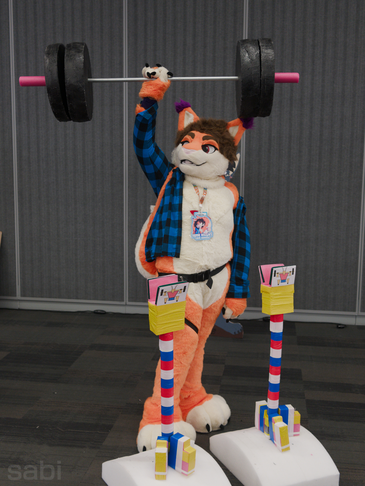
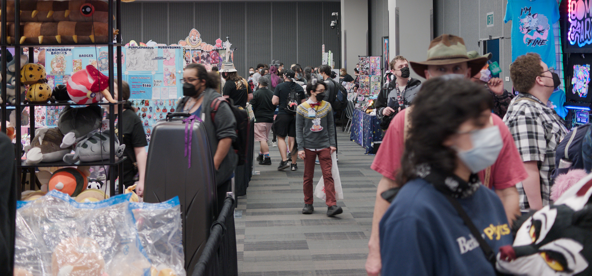
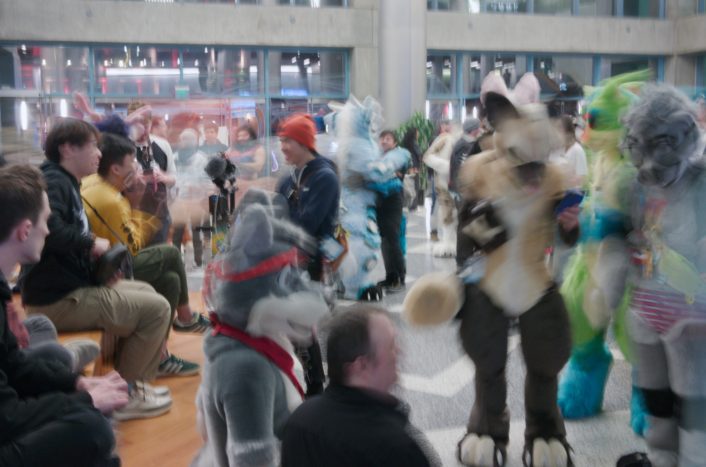
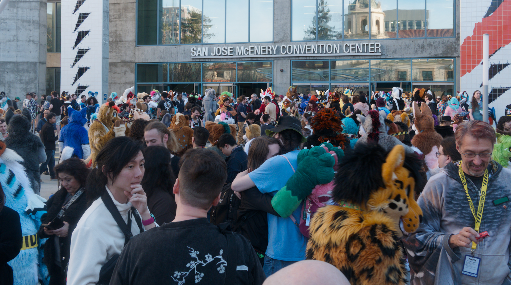
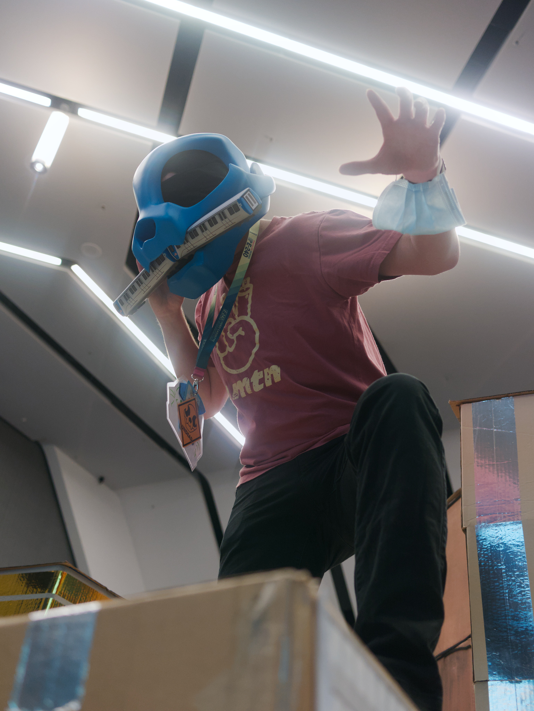
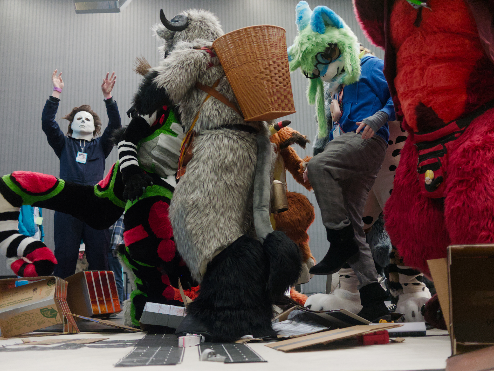

after having such a great time at my first FC last year, i had to go again this year. while the con was mediocre for me (this has nothing to do with the con, but rather my own shortcomings. i need to be more social xwx), i still had an excellent time! though it remains uncertain whether i'll return next year, i want to give ANE a shot

i decided to take a stab at fursuit photography this convention, despite not having any portrait experience, and only bringing a 20mm f/1.7 m43 lens with me. only about half of my photos were actually usable, but i was only really satisfied with less than a third of all the photos i took. that said, there are some ones i took that i quite liked. while the wide angle was great for capturing seas of congoers and the busyness of the con, it forced me to get up-close and personal if i wanted to take photos of fursuits (which i'm too scared to do ;-;). i actually went out and impulse-bought a portrait lens because of this, a 42.5mm f/1.7 m43, that i'm excited to try out

i learned the hard way that while something looks in-focus on the camera, it might look slightly blurry on a larger screen.... i also learned i need to be more aware of what's in the shot, because some photos would've been much improved if i took a couple seconds to just move some objects out of the way. i think my biggest shortcoming, though, is that i rush when taking staged photos. it sounds silly, but let me explain: i feel like the subject might think "damn, it takes this long to get a photo?" when i'm trying to adjust settings on my camera, figure out good framing, etc., so i get a little sloppy and miss doing some things that would improve the shot, i.e., the lighting could be better, objects need to be moved, etc., all so the subject isn't standing there bored. i experimented with the aperature- and shutter-priority modes (to varying degrees of success, i usually use manual mode), which was very helpful, but i still missed some glaringly obvious details. for example:

*why didn't i notice the huge dumbell rack covering his leg and paw??* oh well, live and learn, haha. without further ado, here's my favorite photos i took:

> michael myers? at *my* further confusion macro meet?? it's more likely than you'd think

if you want to see more photos i took at fc, you can find me on [furtrack](https://www.furtrack.com/user/sabi/)!
