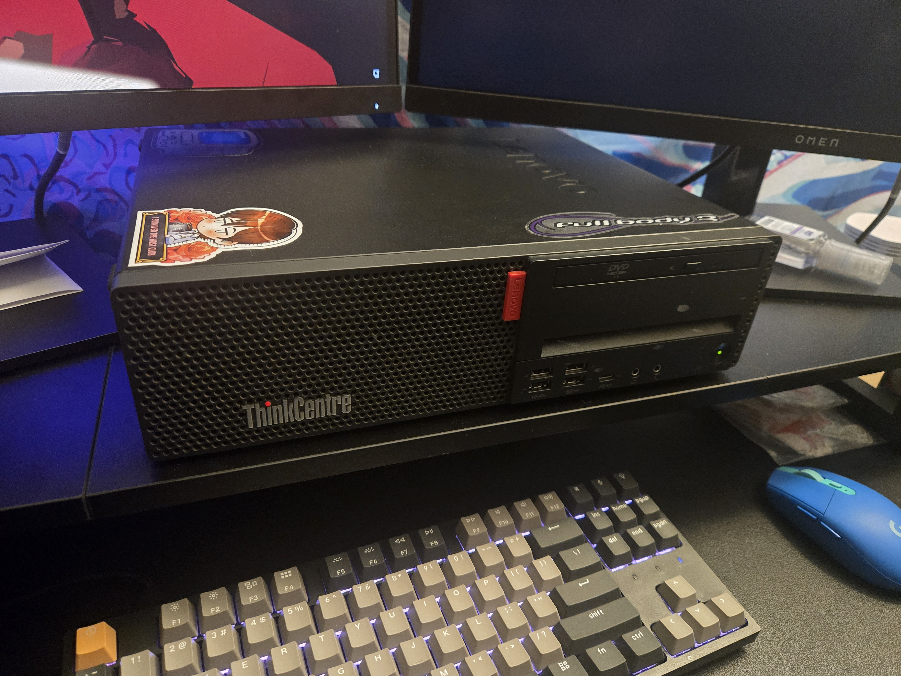

> *note:* this post is **very** information-dense. i try to lay things out in a way that hopefully makes sense, and while this post is partially meant to inform *and* entertain, i tried to make the most helpful tips stand out. 
> 
> also, this post was written over the course of months since i'm continuing to experiment with my homelab to this day ~~and i also kept forgetting to write this~~, so details for things i set up a few months ago are likely quite hazy, sorry x3
> 
> also, i use "homelab" and "server" interchangeably here, but if those are actually totally different things, *please let me know i'm so sorry*

to be honest, the beginning of this story isn't that interesting, so i'll spare you the details: i'd already been thinking about making a server for awhile, mainly so i could host my own music streaming service, but i'd held off for awhile because i didn't really have the space for it, and my parents whom i live with don't love the idea of a constantly-running computer. but, after overhearing a conversation at a friend's housewarming party, i decided that i didn't want to wait to move out like i originally planned to get started on a homelab, and started looking on facebook marketplace for a pc the next day

### hardware - a random pc off fb marketplace

i admittedly did zero research into what kind of hardware would be best for a server. my plan was pretty much just buy a small-ish old office-setting-adjacent pc (something like a lenovo thinkcentre or a dell optiplex) that i could shove storage into and service as necessary and hope it worked out. i thought about a NAS from ugreen and the like, but that was the more expensive option and an old pc was an impulse purchase i would feel less guilty about. after some browsing on facebook marketplace, i came across a listing for a used lenovo thinkcentre m720s with an 8th gen core i5, 16gb of ram, and a 256 gb m.2 ssd for $150. considering that the main thing this server would be used for is file storage and music streaming, and the included storage would just hold the OS while all the data would go on drives i'd put into the pc, this seemed like a pretty good deal

it turns out, despite being released about 7 or 8 years ago, it does not come with wifi by default, nor does it have *any* hdmi ports, only two display ports and a vga port. *really?* the display problem was a little annoying, but an easy solve: my monitors each only have one displayport input, so i just had to unplug one of them from my desktop and plug it into my soon-to-be server. the bigger problem was the lack of wifi on the server. *but sabi,* you might be thinking, *why does your server need wifi? just use ethernet with it.* unfortunately, that's not really an option for me. my desktop uses my ethernet hookup since i stream pcvr pretty constantly, and i don't really have enough space for a router combined with the bigger-than-imagined desktop sitting on my desk. anyways, after some googling, i learned that it can take an m.2 wifi card (which i didn't even realize they made) to add wifi functionality, so i was able to pick one up for cheap off amazon. apparently, while pcie wifi cards technically work, they require a little bit of finagling to work, and i didn't want to deal with that. putting in the card was quite simple, but getting it working was quite an annoying experience

### ubuntu server and netplan woes

before i want to talk about networking woes, i think it makes more sense to talk about the os i chose for my server, first. i admittedly spent more time deliberating over what operating system i wanted my server to run than what the hardware should look like lmao. i considered trying out [proxmox](https://www.proxmox.com/en/), but just looking at their website made me unsure of how to even get started with them, so i nixed them from the list. speaking of nixing, i also thought about [nixos](https://nixos.org/), the trendy new distro that everyone's been using on r/unixporn, which i love to browse while fantasizing about replacing windows 11 on my desktop. musician and youtuber diinki actually has a super cool video about it [here](https://youtu.be/GkMEYlUHvTE), which i highly recommend you check out (i also super love like *everything* about their aesthetic)

the main draw of nixos for me was the fact that everything is reproducible and declarative. simply put: you can take your config from one system, put it on another system, and have the exact same software setup. i like the idea of having everything controlled by what could be a single git repo, and just committing changes that work and rolling back what doesn't (nixos takes a snapshot of every config, so you can easily roll it back if you make a breaking change). but to get nixos set up, you have to learn the nix programming language, which is a functional language, and i know nothing about those. while entirely possible for me to sit down and take time to learn it, it would take a lot of spoons that i often lack after work, plus i already struggle cycling my time between other hobbies, and i wanted something that i'd be able to set up fairly quickly. so nix was also nixed, and i ended up going with ubuntu server just for it's familiarity

getting it installed was fairly easy, but network access without an ethernet cord definitely was not. i admit, i did plug it into my server at the start to be able to download updates, but past that i used an old google pixel 6 pro i had lying around for a wired internet connection. but it wasn't basically plug-and-play like ethernet was. instead, i actually had to tell the system to use it for internet by a software called [netplan](https://documentation.ubuntu.com/server/explanation/networking/configuring-networks/), a distro-agnostic way to configure networks via yaml files. it sounds neat and simple enough, but i've quickly learned that i don't enjoy using netplan, mostly because i've found their documentation not to be very intuitive and i had to figure out how to do basically anything via forum posts. however, i will admit that this is very likely a shortcoming of mine, as i know absolutely nothing about networking, let alone terminology (which the documentation happens to be full of). but here's an example of what it looks like to be able to use my pixel for wifi:

```yaml
# pixel6.yaml
network:
  version: 2
  ethernets:
    enx4e846363b1aa:
      dhcp4: true
    enx7eafbff49b34:
      dhcp4: true
```

in short, this configures two interfaces to be able to automatically assign the server an ip address. *but sabi,* you might once again be thinking, *the pixel is only one device. why are there two configured?* because while i'm not sure how frequently (i think it's every time i restart the server? or plug the pixel in, one of the two, or both), the interface id for the pixel can change. so i store this config in a file called `pixel6.yaml`. actually, that's one of the neat things about netplan: you can have multiple config files to keep things nice and tidy, and it combines them all together. for example, in another config file, i can store my wifi config:

```yaml
# wifi.yaml
network:
  version: 2
  renderer: networkd
  wifis:
    wlp2s0: # interface name
      dhcp4: true
      access-points:
        "your wifi name here": # yes with quotes
          auth:
            key-management: "depends on your network type" # with quotes
            password: "your wifi password here" # still with quotes
```

it's a small thing, but i think it's neat :D

but now that networking is set up, it's time for the fun part and installing services and stuff, right? well, not quite yet. i wanted to figure out how i'd be able to access all the neat services i'd soon set up outside of my home, since my server was currently only accessible via my home network

### tailscale

there's a few ways you can access a device outside of your home network, but the common ones i've heard about are port forwarding, cloudflare tunnels, and tailscale. port forwarding was a no-go for me, since i didn't want to expose my family's network to the vast and terrifying internet. cloudflare tunnels, while an appealing option that doesn't require the use of a vpn, doesn't allow media streaming according to their terms of service (but apparently it's also just not very well optimized for it, according to [xda developers](https://www.xda-developers.com/cloudflare-tunnels-are-great-but-never-use-them-for-media-streaming/)). so i decided to give tailscale a try, and it was super painless to set up. you create an account via their admin console, install it on any devices you want to connect together, and you're done! now, when i'm out and about, as long as the tailscale vpn is turned on, i can access my server. however, this would pose a problem whenever i was travelling (or even just out and about) and wanted to have mullvad vpn turned on for some extra security

in my experience, trying to use more than one vpn at once doesn't go well. usually, regardless of the device, if i have one vpn turned on, i can't even turn on another. this was a problem, since i usually had mullvad turned on practically constantly, but still wanted to access my services via tailscale. thankfully, tailscale directly partners with mullvad so you can use their vpn while tailscale is enabled, but there's a slight downside:

one of the main appeals of mullvad is that there's no subscription, you just pay X amount of money whenever you want to use it for 30 days. if you go a month not needing a vpn, then you don't pay. in contrast, when you use mullvad through tailscale, your tailscale bill goes up by $5/month. but, since i'm US-based, this actually ends up being *slightly* cheaper than paying for a month of mullvad directly, which comes out to ~$5.40

that said, i actually don't consider it to be an annoyance because i was basically paying that cost every 30 days anyways since i use it so often. but that's pretty much the only difference between using mullvad alone and mullvad via tailscale. it still keeps the 5 device cap, but if you want to add another 5 more devices, you just pay another $5/month. despite hitting the device cap, i haven't found a need to raise it just yet

now that i had a way to access my server remotely, i needed an *easy* way to access it

### intermission - look at my server pls

okay, i've thrown a lot of info at you. let's take a small break. 



here's a picture of my server as it currently sits on my desk. even though i love to cover my things in stickers, there's a lack of them here because i wanted to cover it in media-related stickers, which i have a lack of. guess i need to go hunting for them at furcons and the local upcoming anime convention. so for now, there's a TV (way in the back-left corner), ouran high school host club, and full body 2. there'll be more in a later update, prolly

okay, break time over

### my struggles with a custom domain

> **note:** even though this didn't come until *after* i set up some of the services i talk about later, everything past this point kinda feeds into each other. there's some general info in here that you might find helpful, and service-specific stuff can come later

i decided to look into trying to set up a custom domain to use for my server, since the way i was accessing my services was via the docker container manager in cockpit and then clicking on the port numbers. it worked, but was quite inconvenient. i decided i'd much rather have an easy-to-remember url. so i went to porkbun, bought a url, and found a couple helpful tutorials about how to set it up:

- [Remotely access and share your self-hosted services - YouTube](https://www.youtube.com/watch?v=Vt4PDUXB_fg)
- [Automatic Homelab HTTPS with Caddy and Cloudflare - samedwardes.com](https://samedwardes.com/blog/2023-11-19-homelab-tls-with-caddy-and-cloudflare/)

these tutorials were simple enough, but something that wasn't covered was how to keep caddy alive, since i had to use a custom build in order to support porkbun. thankfully, that's covered by caddy's official documentation [here (Keep Caddy Running — Caddy Documentation)](https://caddyserver.com/docs/running). i haven't yet figured out how to install updates to caddy, but i'll cross that bridge when i get to it lol

following the tutorials didn't take long, but i encountered a number of issues with it. at first, it was having trouble issuing tls certificates, raising errors like `could not find the start of authority` and `NXDOMAIN`. thanks to [this](https://github.com/tailscale/tailscale/issues/7650#issuecomment-2884282645) random github comment, i learned that one of the steps in tailscale's youtube tutorial actually doesn't work 100% of the time: the step where you use a **CNAME** record for the dns. *turns out, you should actually use an **A** record, and point it to the ip of whatever is running caddy.* the dns propagation was surprisingly quick, and after doing that, my domains were working just fine...

...until a couple months later when i decided to try setting up soulseek on my server and wanted to add a new domain for it. slskd requires a bit of special config in order to get working with caddy (which i talk about later), but the main problem i encountered was with `solving challenges: waiting for solver certmagic.solverWrapper to be ready` when i'd restart caddy. for whatever reason, it was taking a very long time to solve the challenges it was issued, despite being super quick a few months back. i could see it writing dns records in porkbun by checking their web console, but it was taking forever to find them. while i never found out the reason why, i was able to figure out something of a band-aid fix. caddy as a couple of helpful options, `resolvers` and `propagation_timeout` that you can use. according to [caddy's docs](https://caddyserver.com/docs/caddyfile/directives/tls#propagation_timeout), `resolvers` changes the DNS resolvers used for the DNS challenges, and `propagation_timeout` sets the maximum time to wait for the DNS txt records to appear. while setting `resolvers` didn't help anything for me, `propagation_timeout` did, so now my config looks something like this:

```
# (currently) working config :D
(porkbun) {
  tls {
    dns porkbun {
      api_key nuh_uh 
      api_secret_key no_way
    }
    resolvers 1.1.1.1 8.8.8.8 # cloudflare w/ google backup
    propagation_timeout 10m # 10 minutes
  }
}
```

which seems to be working. hopefully, when i inevitably make more changes in the future (likely adding immich and nextcloud), it'll work just fine and i won't have to waste another hour trying to figure out what's wrong xwx

### file server - copyparty

before i had the hardware for my server, i learned about [copyparty](https://github.com/9001/copyparty) purely by chance from a crazy yt algorithm pull where the developer talks about all the features it has and it's development process. it was crazy impressive and cool, and seemed really useful. so naturally, when it came time to set up my server, copyparty is literally the first service i set up (besides cockpit). and i can in fact confirm that it's crazy impressive and cool and really useful. it's not hard to get up and running, and despite the random occasional crash, i've still found it a joy to use

i use it to turn my home directory into a fileserver, and using rclone i mount it as a drive on my desktop, so i can use musicbee to manage all my music. it's also super handy for being able to upload to and download from it anywhere. i was able to use it while vacationing in japan to upload music albums i bought during bandcamp friday from my laptop to the server to be able to stream them on my phone with navidrome (which you'll learn about in the next section!). as an added bonus, it was also really easy to configure access for my friend so she could store her music on the server, too

if you need a file server for any reason, i highly recommend this service! my only gripe isn't even with the server itself: it's that i wish that this particular service on my server was exposed to the internet so i can stream the occasional odd video from it to my friends on vrchat, but the internet is scary lmao

### music streaming - navidrome

honestly, the main reason i even wanted a server in the first place was so i could have a personal music streaming service, and [navidrome](https://www.navidrome.org/) is *perfect* for that. the way i used to store all my music was just on my desktop's hard drive, which was functional and worked great if i wanted to listen to music on my pc. but if i wanted to listen to that same music on my ipod or phone, i'd have to sync it over usb, which while not hard, is certainly very inconvenient

once i set up my server, i moved all my music over to it using copyparty and pointed navidrome to the music directory. the neat thing about how navidrome works is that it uses the tags on your audio files, so if you're very anal about tagging things properly like i am, it just works(tm). i did run into a couple issues where things that i thought should appear under the same album like they do in musicbee actually show up under separate albums in navidrome, but i do some weird shit with audio (i.e. archiving friend's dj sets over multiple years, and the year on each track is the year it's from), so you likely won't run into the same problems i have if you're just archiving albums and/or individual tracks

but now, anytime i buy new music, i can put it on the server via copyparty, and stream it on my phone with [symfonium](https://symfonium.app/). granted, i still have to copy new music over to my ipod via usb, but what do you expect it's an ipod classic lol. one thing i've been curious to try out is if casting music via symfonium still works, since my home network isn't on the tailnet, but i haven't had the chance to try it out yet

### dashboard - cockpit

i use [cockpit](https://cockpit-project.org/) as a sort of dashboard for my server (every time i try to install [homepage](https://gethomepage.dev/) via docker as a prettier dashboard, it can't resolve the container image, so i gave up lol). it's very simple to set up and use, and it has been indispensable. primarily i use it as a quick way to get terminal access (not that i have anything against ssh. i'm actually not sure why i don't just use that), checking on services, and viewing logs, but it can do a lot more than that

another neat thing about cockpit is that it has a good amount of extensions for adding more functionality. but, for some reason, it doesn't have an official extension for interacting with docker containers. it has an extension for podman containers, which are similar and theory, and the extension is still supposed to work for docker containers, but podman and docker aren't the same thing. thankfully, without much searching, i found [this](https://github.com/chrisjbawden/cockpit-dockermanager) community-made extension that works with docker containers, and it works basically flawlessly

while cockpit has an easier port number to remember than other services (9090), i still wanted to set up a url for it. when i tried doing so, i followed the exact same setup for my other applications, but came across an issue where cockpit didn't want to respect the new url. thankfully, i found [this](https://notes.xeome.dev/notes/Cockpit-caddy-reverse-proxy) blog post about how to get cockpit working with caddy. it wasn't too hard, but i learned that if you're directing to `http://localhost:9090` in your caddyfile, you'll need to take out the `http://` (which is honestly how all your directs should look, so something like the below)

```
cockpit.mydomain.com {
  reverse_proxy localhost:9090
  import porkbun
}
```

### music sharing - soulseek

for the unfamiliar, [soulseek](https://www.slsknet.org/) is a filesharing network that's primarily used for sharing music. i wanted to set it up on my server since i'd been a leecher for awhile (i'm sorry, but i currently still live with my parents, and they don't like when i have a noisy gaming pc turned on 24/7!), and now that i was hosting my music on something that's (hopefully) on 24/7, it made sense to share it

after some quick googling, i found [slskd](https://github.com/slskd/slskd), a client-server app for soulseek with a docker build. i struggled a little bit with configuring it (tl;dr: trying to set environment variables in `docker-compose.yml` didn't work for me, i had to edit the generated `slskd.yml`), but once it started running, i haven't had any issues with it!

giving it a domain with caddy is a little more advanced since they do some stuff with ports that i don't really understand enough to explain, but i found [this helpful github issue](https://github.com/slskd/slskd/issues/939) that tells you exactly how to set up caddy for it to work. mine looks like this:

```
soulseek.mydomain.com {
  reverse_proxy localhost:5030 {
    header_up Upgrade "websocket"
    header_up Connection "Upgrade"
  }
  import porkbun
}
```

### the current state of my homelab

honestly, i feel like i'm at a pretty good spot with my server right now. it does exactly what i need, and i only need to *occasionally* fiddle with it whenever something stops working randomly for reasons unbeknownst to me (which is annoying, but i feel like that's part of the ✨ experience ✨). even though it was a hell of a lot of googling and so much more hours than i thought it'd be to get stuff set up (but tbh i'm not sure how much i was expecting), i think it's definitely been worth it. while my set up is certainly not "optimized" (should i get a NAS? do i need to worry about RAID at all?), it works pretty well. i was even able to share it with a friend via tailscale, and she's been able to get some use out of it as well for storing music

maybe i'll actually find some use for jellyfin in the future, but i currently don't mind just having it sit and do nothing. the thing i'm most excited for is actually setting up a gsuite replacement with nextcloud and immich because, while google already didn't respect privacy, i don't love how gemini now pores through practically everything you store with them. but the thing that i can do most immediately is have a sort of "homepage" for my server (not my cockpit dashboard) that basically serves as a list of links for services my server runs as well as some rules, in case i end up letting more friends onto it. thankfully, caddy already actually has the ability to serve static site files built-in, i just need to utilize it

but this definitely isn't the end of my homelab journey (did you notice the slug for this post says "part 1"?), so be sure to stay tuned for more (or don't, up to you!)
