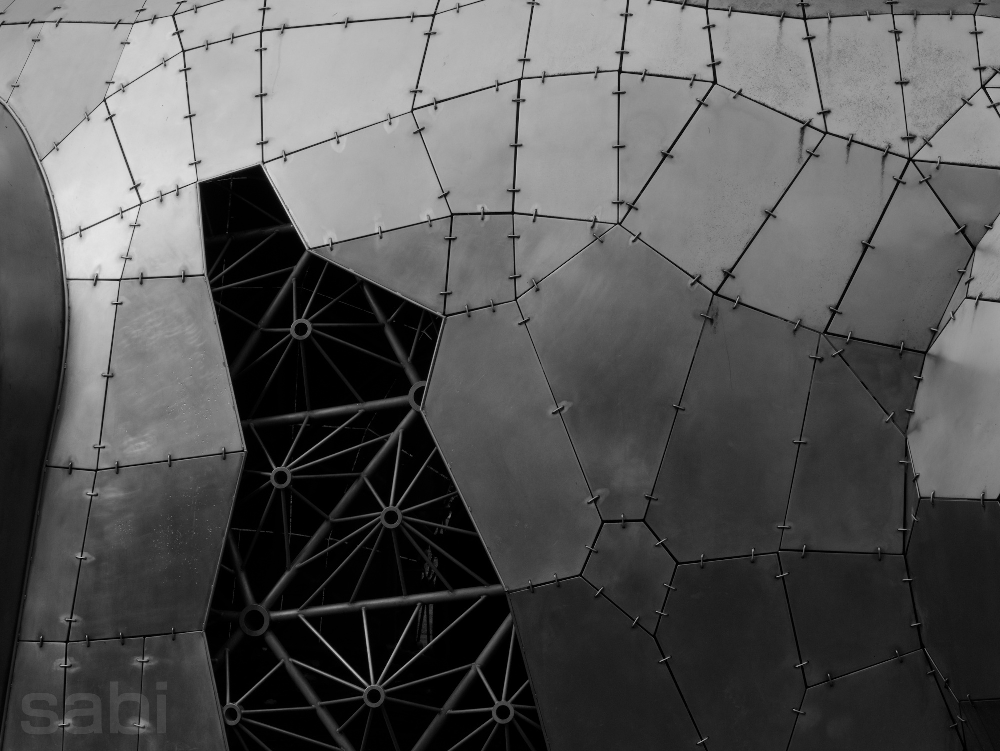
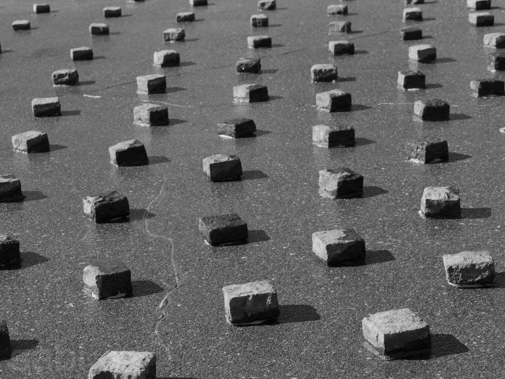
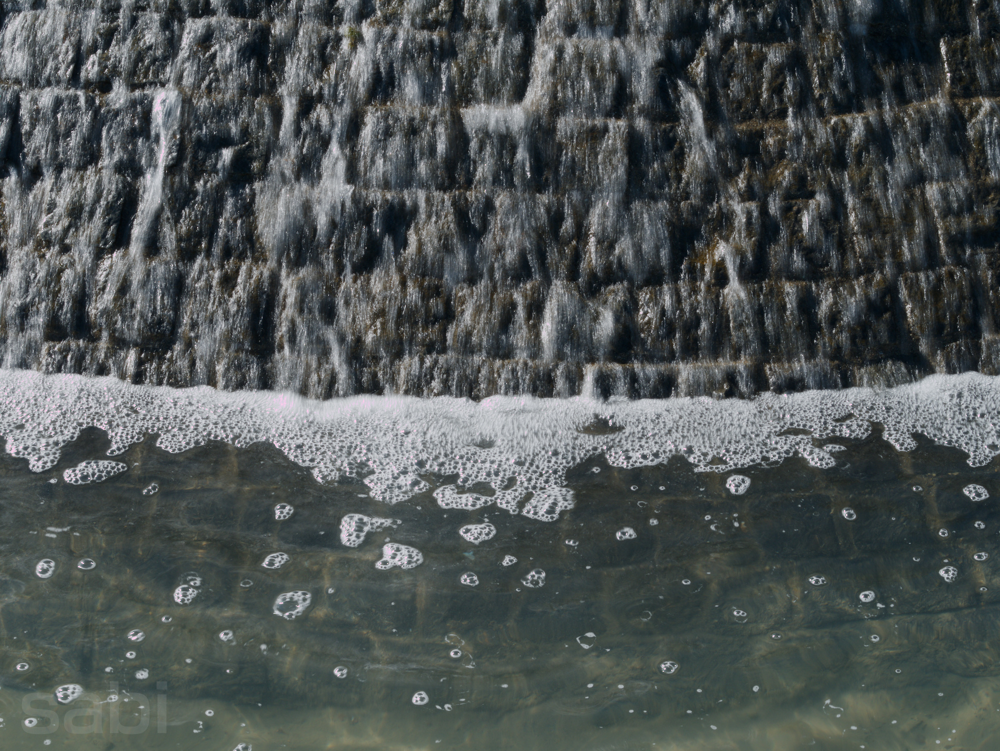
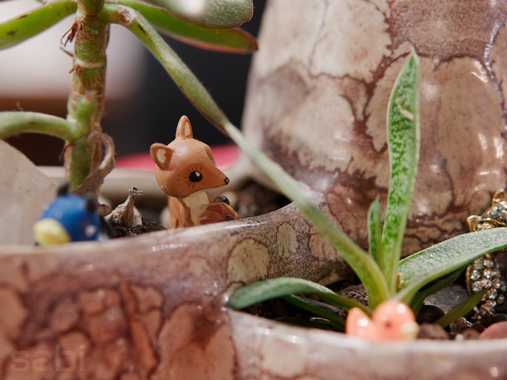
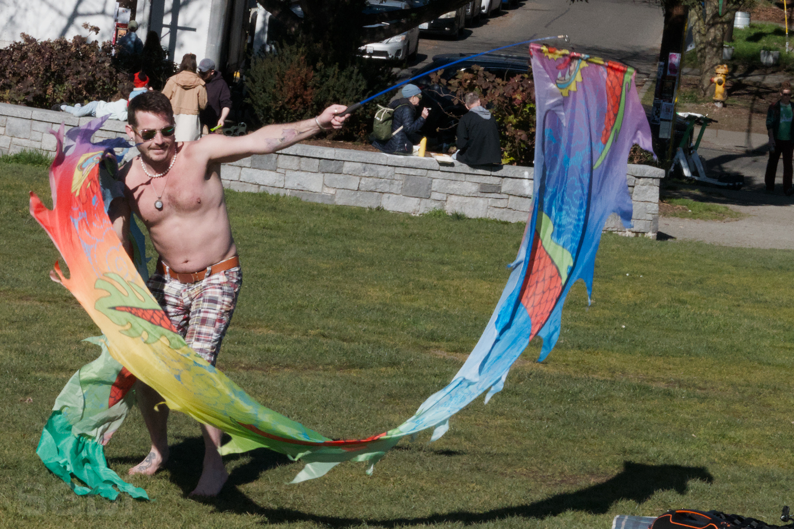
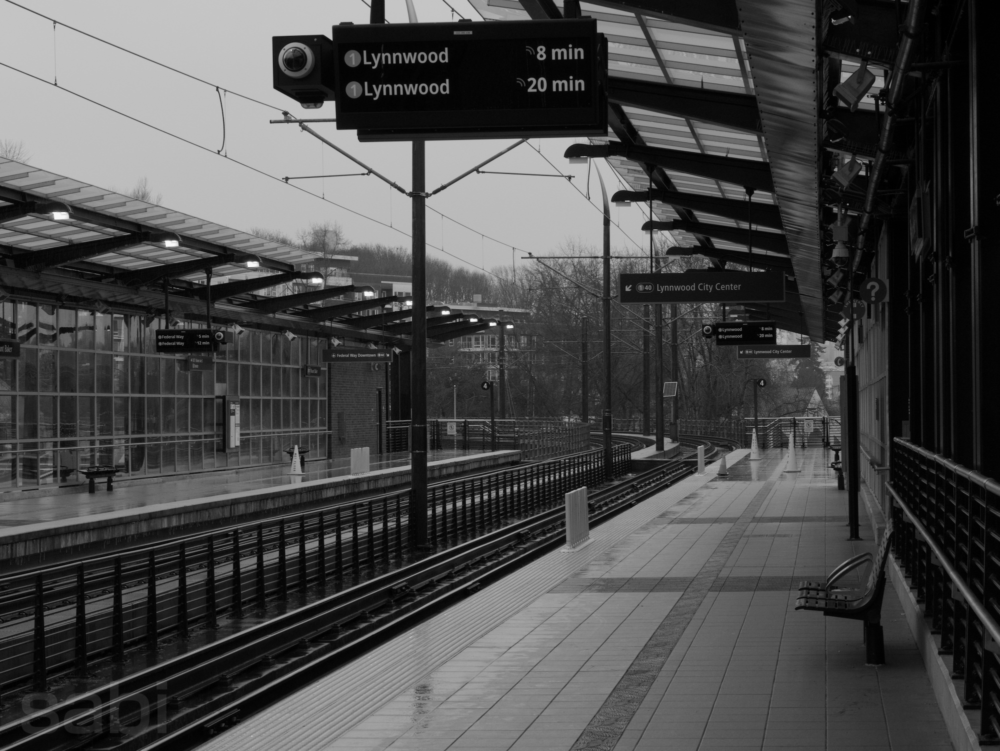
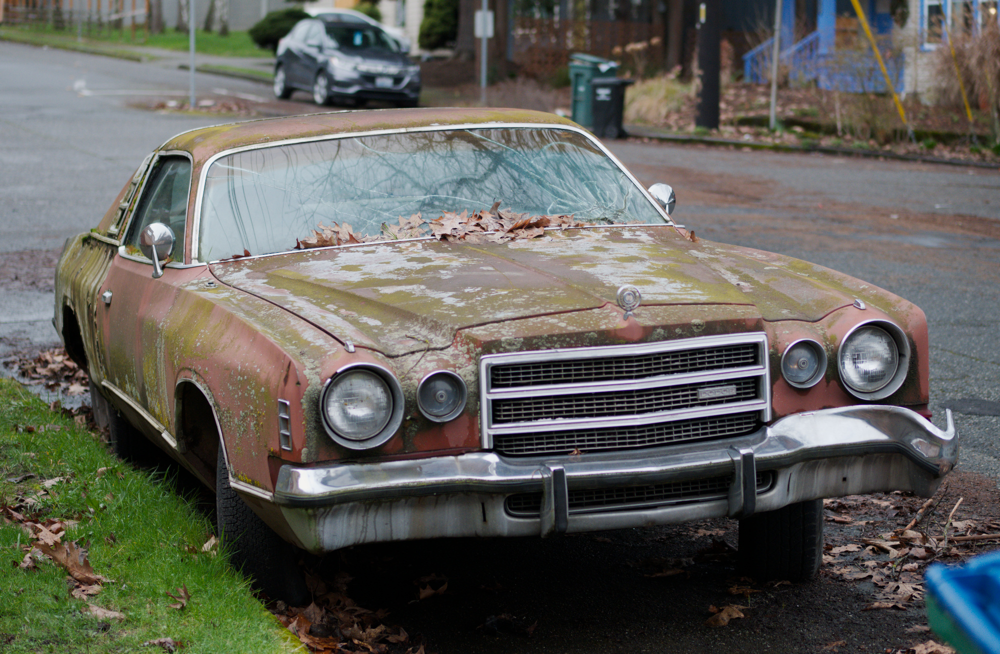
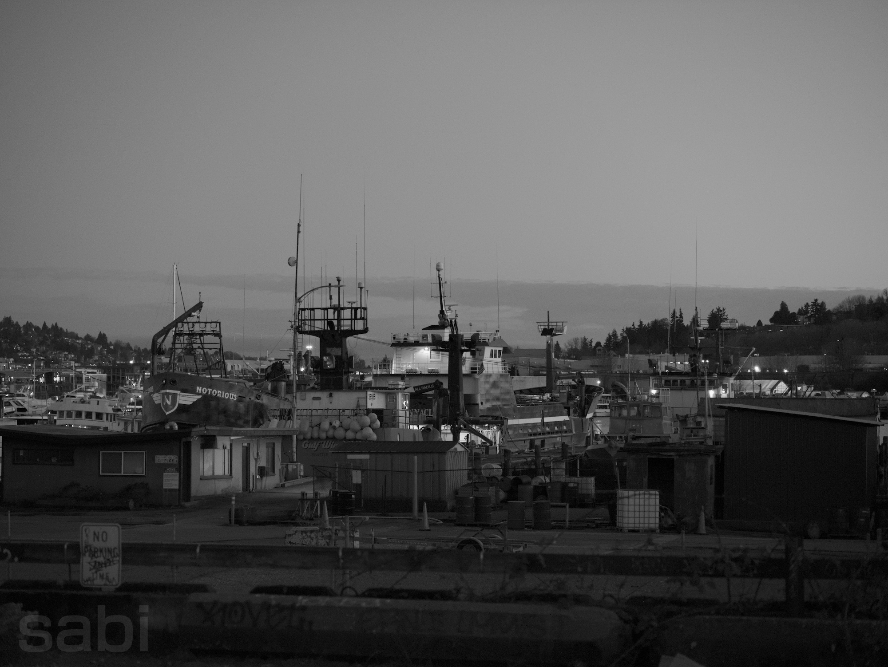
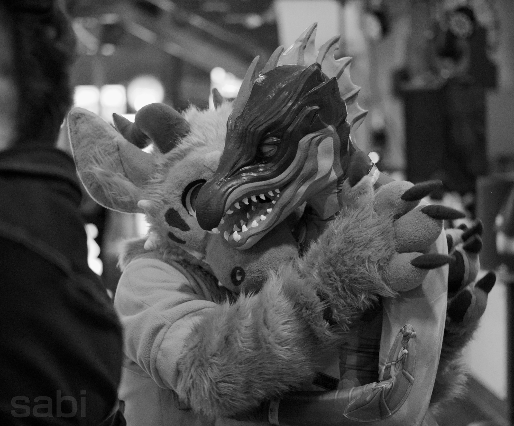
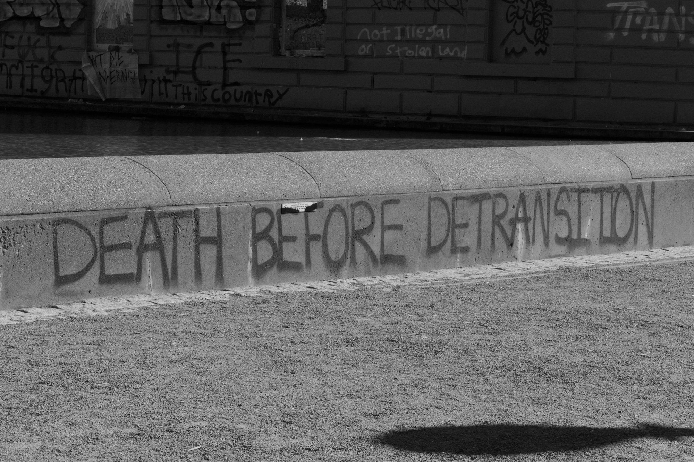

last sunday, i returned home to kansas city after visiting seattle for a week. this was my third trip there, my first one being back in august to see if it was a place i'd want to move to. i basically ended up falling in love with seattle instantly, so i scheduled another trip with the intent of checking out different neighborhoods to see where i'd potentially want to move to. that was this trip, and honestly? it was kind of a bust... if i evaluate the trip only by whether i completed that goal

since i was working the entire time (i'm very thankful my job is fully remote, so i can travel and work at the same time), it made actually exploring very difficult, since i'd work during the weekdays and hang out with friends in the evenings, leaving primarily only the weekends to check different parts out. i booked airbnbs in fremont, u-district, and capitol hill, and stayed with a friend in their neighborhood for a little, and only really ended up getting to explore u-district and capitol hill because of the dates i booked. but at the start of the trip, i met up with a close friend (that i made on vrchat like, 6 years ago! crazy how time flies) for brunch who gave me some advice (that i'm slightly paraphrasing):

> don't worry too much about where you're gonna move. chances are, the first lease you get isn't going to be the one you renew. you might move to one area, only to find you actually like a different area more that fits your needs better

i've never done this "moving out on my own" thing before (i don't count moving into college dorms), so i hadn't even considered this. maybe i didn't need to schedule another trip to seattle just to see which area i want to move to. but i'm honestly glad i did, i got to meet new people, see more friends i haven't seen in awhile, and see if the city really is the place for me. which, at this point, i'm pretty sure it is. seattle is so beautifully nerdy and laid-back and queer as fuck, which i absolutely love. it's hella walkable, with good public transit that you can take almost anywhere (it's a little slow though). sure, it's rainy most of the year, but it's absolutely gorgeous when it's sunny. i can't wait to move out there, but now i need to start looking for places and roommates... which i also know nothing about XwX

but while i was out there, i tested out a new portrait lens i picked up for my camera, a prime m43-mount 42.5/f1.7 for portrait photography. i picked it up at glazer's (a seattle camera store) a month prior, since i went on a weekend trip with a friend to see an artist we both love (if you love trance, i highly recommend TDJ) and we're also both photography hobbyists lol. shooting with it was quite different than the wide angle i had picked up in japan and was used to, since it, well, isn't a wide angle. i couldn't capture the sweeping landscapes and crowds like i typically do, so i decided to play with something else that forced me to get close: textures

before i finished editing my photos, i watched [this](https://youtu.be/uaBe78nf10w) hella-interesting youtube video about composition. i highly recommend giving it a watch, but if you don't, the tl;dr is **don't worry about grids (rule of thirds, golden ratio), create interesting shapes instead**. not quite sure what that means? watch the video :) i already think my compositions would be much more improved if i took them in more dynamic angles, but you can't really fix that in post. the next best thing is rotating and cropping, so keeping the video in mind, i tried it with the rest of my images, and i think i did it the best on this one, despite it being slightly blurry (i was a little far away):

i also started playing around with putting images in black in white. i learned from a friend (the same friend who gave me the moving advice outlined before, actually) that putting photos into black and white during editing can help you nail contrast, and that some photos actually just hit harder in black and white. so i decided to give those a try, and i definitely see what she means. even if the final result will be in color, being able to nail the contrast in black in white definitely helps the colors pop more in the final version

