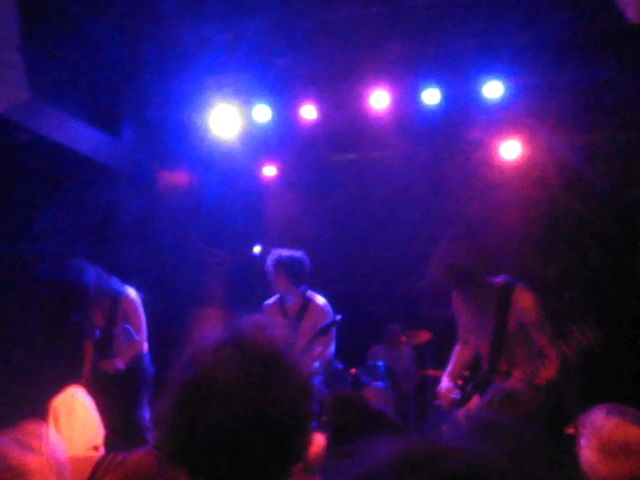
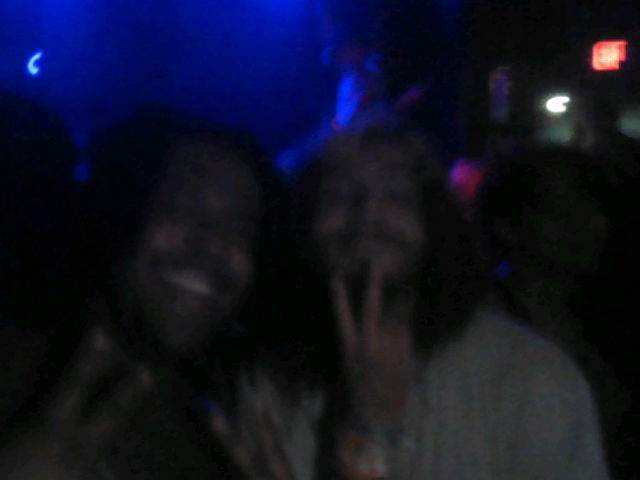

a couple weeks ago, an old local high school friend of mine reached out and asked if i wanted to go to a punk concert with him since his favorite band was coming to play. i'd never (actively) listened to punk before and wanted to broaden my music horizons, plus i love going to live shows, so naturally i said yes. it finally came time for the concert last night (may 31st, 2026), for us to see cheerleader roadkill with supporting bands sap and awannabe at encore at the uptown theatre in kansas city, missouri. i put together an outfit, 3ds and earplugs in tow, and grabbed a ride from my friend to the venue. and it's now one of my favorite concerts i've ever been to

all three bands were incredible. none of them felt serious, like they were there to have a good time, and that absolutely came through in the way they interacted with the crowd. lots of crowd interaction and laughter, they even stripped ~~their shirts~~ for us 👀. but i think the lead singer/guitarist of the second band, awannabe, was my favorite. the band kept experiencing technical difficulties at the beginning of their set, but they pushed through it like champs, the singer swearing but smiling throughout all of it

i got to participate in the classic punk ritual of a mosh pit, and i'd never been in a proper one before (church youth groups haven't the foggiest idea of what an adult mosh pit is like), and holy fuck it was an incredible, eye-opening experience (or eye-closing, since i got bumped in the cheek and eye and couldn't keep it open for a little bit after lol). people thrashing about with each other in a huge pit with total abandon of rhythm or control, but instead some other drive that i have yet to be able to describe. people did get knocked over, there were absolutely some minor injuries, plenty of items lost, yet a mosh pit still broke out every 5 minutes anyways, we simply couldn't resist. yes, we. me and my friend couldn't resist the temptation ourselves either, and god i loved it. getting lost in the current of pure physical chaos. i don't know if moshing is considered a form of dance, but it should be if it isn't

another concert ritual i'd heard of was crowd surfing, but i'd never actually seen it before in person, since that's not really a thing at edm events (at least, the ones i've been to, nor have i ever really heard of it happening??). so it was a pleasant surprise witnessing it tonight, or rather, witnessing so many attempts of it. the bands were surprisingly comfortable with people coming up on stage for a bit *while they were performing* (i could never), most of whom doing so attempting to crowd surf (and everyone was respectful of the band!). unfortunately, the crowd was full of twinks with no upper-body strength, so there was a less than 50% success rate of someone crowd surfing for more than three seconds (and if the surfer was even slightly chubby, the rate was even lower. god forbid a fat dragon like me tries ☠️)

one of the surprising things i'd noticed was everyone seemed to already understand that people were gonna be close together and bump and jostle into each other in such a packed environment. you'd think that'd be a universal realization, but i feel like a lot of times when i go to clubs or raves, even sometimes furry convention raves, this is not a shared realization, and people can be... *repulsed? annoyed? upset?* when you bump into them. which makes me feel bad, since i'm both tall and wide, and bumping into people happens often on my end, as much as i try to avoid it. so getting to dance while not feeling like i was going to get told off for bumping into someone was a nice change

my only issue with the concert wasn't with any of the performers or logistics, but rather the venue itself. i'm used to venues having free water in some capacity, whether it be you ask the bartender for a cup, or it's just sitting there in one of those iconically shitty always-beat-up-for-some-reason orange igloo coolers you see at sporting events with paper snow cone cones next to it. that wasn't a thing at this venue, you had to pay $3.50 for a simple 16.9oz plastic nestle water bottle. i get that it's a bar and they wanna make money from drink pricing, but christ that's ridiculous, and there are people that will refuse to pay it to save money, even if they're thirsty. i think every venue needs a way to hydrate for free, so people aren't passing out on the dance floor (and i mean sanitarily, no drinking bathroom sink ~~or toilet~~ water)

that said, the concert was absolutely incredible and i absolutely would love to go to another punk show again. i even bought a cd of cheerloader roadkill's latest album as a souvenir, which i'm gonna rip and put on my navidrome when i get a chance

